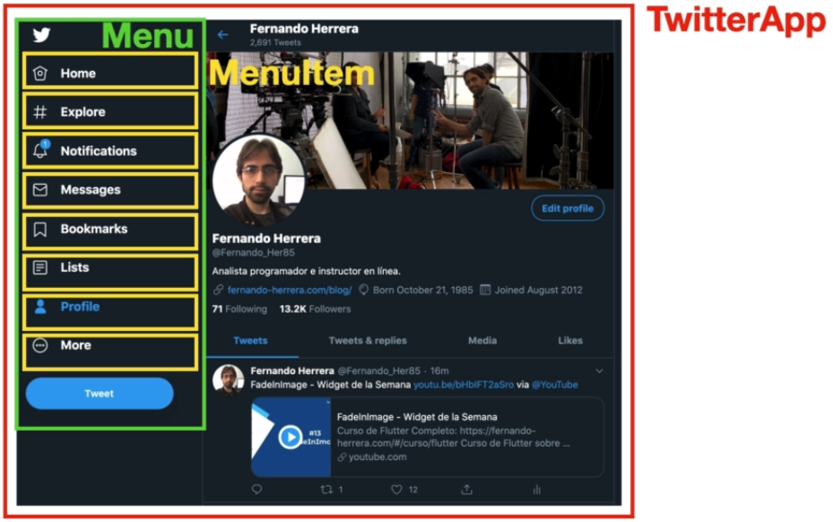
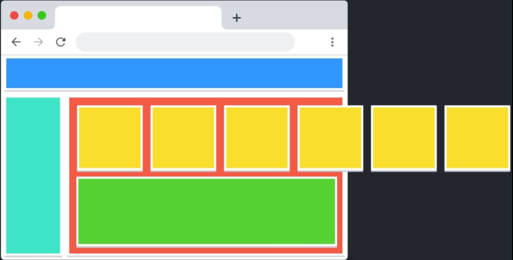
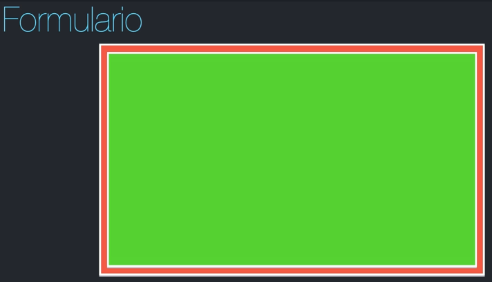
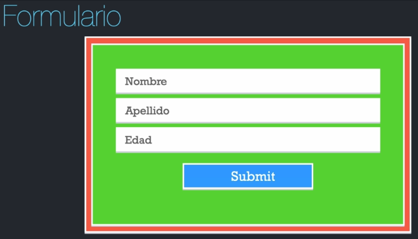
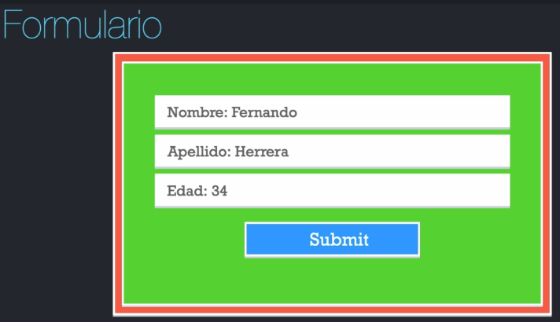

## ¿Qué es un componente React?

Pequeña pieza de código encapsulada re-utilizable que puede tener estado o no.

### Componentes

> Toda y cada una de las partes que conforma la Página de Twitter podría ser un componente
> Por ejemplo Toda la página podría ser el componente __TwitterApp__ que va enmarcar todos los componentes hijos, como el componente hijo __Menu__ el cual sería el mismo en todas las páginas de Twitter, dentro de éste podríamos segmentarlo aún más y crear un componente __MenuItem__ para cada uno de los ítems del menú, algo que deberíamos notar es que estamos usando _Upper camel case_ para crear los componentes, no es obligatorio, pero es una buena práctica.

Si lo vemos de una forma un poco más abstracta:

> Tenemos el __TwitterApp__ como un componente principal, dentro podríamos tener __Router__ éste componente nos ayudaria hacer navegación entre páginas sin hacer refresh del navegador web, dentro del Router podríamos terner diferentes pantallas o screens "__Screen/Página__", dentro de éste podríamos tener un __Menú__ y dentro un __MenuItem__ y de ésta manera se van creando un árbol en nuestra aplicación de React.

Ahora tenemos nuestra aplicación web:

El cual vamos a renderizar ciertos componentes, cada uno de estos componentes es responsable de alguna acción en específico a su vez como lo vimos en el ejemplo de Twitter, los componentes pueden tener otros componentes hijos, unos dentro de otros ahora noten que el cuadro amarillo es el mismo en cada una de sus apariciones pero va a tener ciertos elementos que lo hacen diferentes uno del otro, pero en general es el mismo concepto del __MenuItem__, y agreguemos ótro componente (verde) que podría tener un formulario, una validación, ó lo que se requiera hacer, nuevamente cada uno de estos cuadros son componentes.

### Ahora ¿Qué es el estado?

Enfoquémonos en el componente __verde__:

Cuando es mostrado o renderizado la primera vez, tiene un estado inicial:

Ese estado inicial, es como se encuentra la información de ese componente la primera vez, cuando se cargue ese estado como que el (__Nombre, apellido y edad__) no tienen ningún valor, por consecuencia el componente despliega ésta información en pantalla, pero eventualmente el __Usuario__ empieza a escribir, hace modificaciones y ahora ya tenemos nuestro formulario con valores.

Cada vez que el usuario tocó una tecla y se cambia el HTML por decirlo así o mostramos la información en pantalla, eso cambia el __estado__, entonces en pocas palabras el estado es como se encuentra la información del componente en un punto determinado de tiempo.

